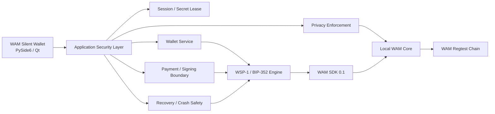

<div align="center">

# WAM Silent Wallet

### Private-by-design desktop wallet for WAM Silent Payments

**WSP-1 / BIP-352 · PySide6 / Qt 6 · Local WAM Core · Reproducible macOS builds**

> **Experimental — REGTEST ONLY**  
> This repository is under technical and security review.  
> It is **not** approved for WAM mainnet funds.

</div>

---

## Overview

**WAM Silent Wallet** is an experimental desktop wallet built to validate a complete Silent Payments workflow on WAM.

The wallet combines:

- a native desktop application layer;
- the **WSP-1 / BIP-352** protocol engine;
- a dedicated **WAM SDK** integration;
- a local validating **WAM Core** node;
- hardened signing, recovery, privacy and release boundaries.

The current milestone is focused on **correctness, security, deterministic recovery, reviewability and regtest qualification** before any mainnet or public-release claim.

---

## Project status

| Area | Status |
|---|---|
| Desktop wallet | ✅ Implemented |
| WSP-1 / BIP-352 integration | ✅ Implemented |
| Silent Payment send / receive | ✅ Regtest validated |
| Scanner / accounting / reorg handling | ✅ Implemented |
| PSBTv2 / P2TR signing boundary | ✅ Implemented |
| Encrypted key storage | ✅ Hardened |
| Crash-consistent payment state | ✅ Implemented |
| Backup / recovery | ✅ Implemented |
| WAM SDK integration | ✅ Implemented |
| Local WAM Core RPC integration | ✅ Implemented |
| Network privacy enforcement | ✅ Implemented |
| Reproducible macOS packaging | ✅ Qualified |
| Independent WAM maintainer review | ⏳ Pending |
| Independent security review | ⏳ Pending |
| WAM mainnet profile | ⏳ Pending |
| Public signed / notarized release | ⏳ Deferred |

---

## Architecture



### Repository boundaries

| Component | Responsibility |
|---|---|
| **wam-silent-wallet** | Desktop UI, session handling, orchestration, key-file hardening, privacy enforcement, release engineering |
| **wam-silent-payments** | BIP-352, secp256k1, scanner, accounting, PSBT/signing, descriptors, recovery primitives |
| **WAM SDK** | RPC configuration, cookie authentication and typed WAM Core client access |
| **WAM Core** | Consensus, chain state, UTXO validation, mempool policy, relay and confirmation |

Protocol engine:

**https://github.com/Urriki1502/wam-silent-payments**

WAM Core:

**https://github.com/wamcoin-core-dev/wam-coin**

Detailed architecture: [docs/ARCHITECTURE.md](docs/ARCHITECTURE.md)

---

## Security model

The wallet is designed around **fail-closed boundaries** rather than silent fallback.

### Key protection

- encrypted `keys.wsp` key material;
- authenticated AES-GCM outer protection;
- strengthened, versioned scrypt password-hardening layer;
- backward-compatible migration from the legacy WSP envelope;
- private wallet files restricted to local-user access;
- wallet/database identity validation before key migration;
- spend keyring opened only at the signing boundary and closed before broadcast.

### Transaction safety

- user-approved transaction manifest;
- frozen PSBT signing boundary;
- signer output checked for unauthorized mutation;
- UTXO revalidation before broadcast;
- `testmempoolaccept` before `sendrawtransaction`;
- draft, signed, broadcasting, uncertain and broadcast states kept distinct;
- pre-broadcast rejection is not misclassified as an uncertain send;
- signed reservations are never silently recycled after an ambiguous broadcast.

### Crash consistency

- SQLite-backed durable wallet state;
- deterministic scanner rollback and reorg handling;
- recovery activation journal;
- payment journal for irreversible signing states;
- label metadata reconciliation if the database commits before `keys.wsp` replacement;
- atomic private-file replacement with filesystem sync.

### Network privacy

The desktop wallet talks only to a **local WAM Core RPC endpoint**.

Before signing and again before broadcast, the application validates the active node/network privacy boundary and fails closed on:

- inactive networking;
- non-loopback RPC;
- missing cookie authentication;
- ambiguous partial-proxy routing;
- mixed Tor/direct routing that cannot be treated safely.

The wallet does **not** rewrite `wam.conf` and does not claim that a generic proxy is Tor.

---

## Current capabilities

- Python 3.12 desktop application;
- PySide6 / Qt 6 interface;
- wallet lock / unlock session;
- dashboard, Receive, Send, Payments, Node, Privacy and Backup views;
- base and labeled Silent Payment addresses;
- BIP-352 sender and receiver derivation;
- coin selection and reservation;
- PSBTv2 / P2TR signing;
- transaction review manifest;
- local WAM Core chain attestation;
- mempool-aware scanning;
- confirmed / unconfirmed wallet accounting;
- restart-safe scanner state;
- reorg rollback;
- payment history;
- encrypted recovery bundles;
- disposable recovery verification;
- restore + required post-recovery reconciliation;
- WAM SDK / WAM Core integration;
- hardened local key storage;
- network privacy status and broadcast enforcement;
- macOS ARM64 application packaging;
- deterministic/reproducible app-content qualification;
- hash-locked dependencies;
- CycloneDX SBOM;
- ZIP / DMG release packaging;
- Developer ID / notarization pipeline available for a future approved release.

---

## End-to-end regtest flow

```text
Silent Payment address
        ↓
payment review
        ↓
BIP-352 output derivation
        ↓
PSBT construction
        ↓
manifest validation
        ↓
signing boundary
        ↓
UTXO revalidation
        ↓
testmempoolaccept
        ↓
broadcast
        ↓
confirmation
        ↓
receiver scan
        ↓
payment detection
        ↓
balance / history
        ↓
spend
```

This flow has been exercised against a **real local WAM regtest node**. It is not a mocked GUI-only path.

---

## Protocol and SDK layout

Recommended review / development layout:

```text
workspace/
├── wam-silent-wallet/
└── wam-silent-payments/
    ├── src/wam_sp/
    └── integration-deps/
        └── wam-sdk/
```

The wallet currently consumes:

```text
wam-silent-wallet
        ↓
wam-silent-payments
        ↓
WAM SDK 0.1
        ↓
local WAM Core RPC
```

The **WAM SDK is already included inside the pinned WSP repository** under:

```text
integration-deps/wam-sdk/
```

WAM Core itself is intentionally kept as an external local-node dependency rather than bundled into this desktop repository.

---

## Development

Recommended sibling checkout:

```bash
workspace/
├── wam-silent-wallet/
└── wam-silent-payments/
```

Bootstrap:

```bash
./scripts/bootstrap_dev.sh
source .venv/bin/activate
python app.py
```

See [docs/DEVELOPMENT.md](docs/DEVELOPMENT.md).

---

## Release qualification

The current release-engineering gates cover:

```text
locked source identity
        ↓
hash-locked dependencies
        ↓
supply-chain verification
        ↓
artifact rebuild verification
        ↓
full regression
        ↓
release contamination scan
        ↓
independent packaged build A
        ↓
independent packaged build B
        ↓
reproducibility comparison
        ↓
clean repository verification
        ↓
provenance
        ↓
release evidence
```

macOS qualification additionally exercises packaged application launch, clean shutdown, ZIP / DMG generation and release-manifest verification.

**Developer ID signing and Apple notarization are intentionally deferred** until the codebase has completed WAM maintainer review and an actual public release is approved.

See [docs/RELEASE.md](docs/RELEASE.md).

---

## Review requested

The next milestone is **independent WAM technical review**, not feature expansion.

Priority review areas:

1. WAM-specific BIP-352 assumptions;
2. mainnet / testnet Silent Payments profile;
3. scanner and accounting correctness;
4. signing and PSBT invariants;
5. WAM Core RPC / policy compatibility;
6. key custody and recovery behavior;
7. privacy assumptions;
8. regtest-to-production requirements.

Reviewer guide: [REVIEW.md](REVIEW.md)

For a complete wallet review, both repositories should be reviewed together:

- **Desktop wallet:** https://github.com/Urriki1502/wam-silent-wallet
- **Protocol / WSP-1:** https://github.com/Urriki1502/wam-silent-payments

---

## Known limitations

This project deliberately does **not** claim production readiness.

Current limitations include:

- regtest-only validated profile;
- experimental `wamrtsp` regtest namespace;
- WAM mainnet/testnet Silent Payments profile is not yet adopted;
- independent protocol/security review is pending;
- local signing still occurs inside the application process;
- Python cannot guarantee hardened secret-memory zeroization;
- the local validating WAM node remains a trusted dependency for consensus and prevout data;
- no protection is claimed against a fully compromised host OS;
- no post-quantum transaction protocol is implemented;
- public release signing/notarization has not been performed.

Do **not** enable mainnet merely by changing a network constant.

---

## Sensitive material

Never commit, upload, attach to issues or paste into chat:

```text
wallet.db
keys.wsp
.cookie
*.wspbak
wallet passphrases
seed material
private keys
raw recovery secrets
```

See [SECURITY.md](SECURITY.md).

---

## Contributing

Focused technical review and narrowly scoped fixes are welcome.

Priority order:

1. correctness;
2. security;
3. deterministic recovery;
4. scanner correctness;
5. WAM Core compatibility;
6. reviewability;
7. UI polish.

See [CONTRIBUTING.md](CONTRIBUTING.md).

---

## License

MIT

---

<div align="center">

**WAM Silent Wallet**

*Experimental Silent Payments engineering for WAM — built for review before release.*

</div>
