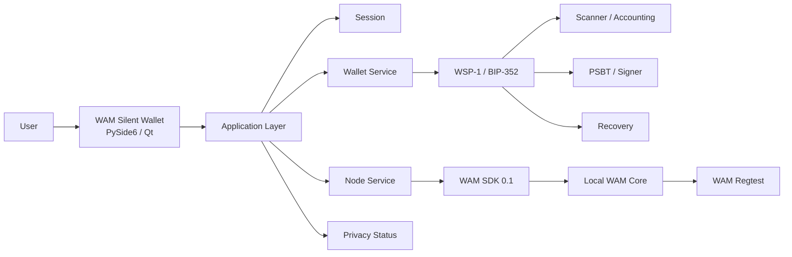

<div align="center">

# WAM Silent Wallet

### Experimental desktop wallet for WAM Silent Payments

**WSP-1 / BIP-352 · PySide6 / Qt 6 · WAM SDK · Local WAM Core**

> **Experimental — REGTEST ONLY**  
> Technical review is required before any production or mainnet use.

</div>

---

## What is WAM Silent Wallet?

**WAM Silent Wallet** is a desktop wallet project focused on bringing **Silent Payments** to WAM through a reviewable, modular architecture.

The project separates the desktop application from the protocol engine:

- **WAM Silent Wallet** — desktop UI and application orchestration;
- **WAM Silent Payments / WSP-1** — BIP-352 protocol, scanner, signing and recovery primitives;
- **WAM SDK** — local RPC client layer;
- **WAM Core** — chain, consensus, mempool policy and relay.

The current public milestone is intended for **regtest validation and technical review**.

---

## Current status

| Area | Status |
|---|---|
| Desktop wallet UI | ✅ Implemented |
| Silent Payment receive | ✅ Implemented |
| Silent Payment send | ✅ Implemented |
| WSP-1 / BIP-352 integration | ✅ Implemented |
| Scanner / accounting | ✅ Implemented |
| PSBTv2 / P2TR signing path | ✅ Implemented |
| Backup / recovery | ✅ Implemented |
| WAM SDK integration | ✅ Implemented |
| Local WAM Core integration | ✅ Implemented |
| Privacy status / network inspection | ✅ Implemented |
| Regtest end-to-end validation | ✅ Implemented |
| Security hardening review branch | 🧪 In review |
| WAM maintainer review | ⏳ Pending |
| Mainnet profile | ⏳ Pending |
| Public production release | ⏳ Pending |

---

## Architecture



### Repository layout

| Repository / component | Role |
|---|---|
| **wam-silent-wallet** | Desktop application, UI, session, orchestration and release UX |
| **wam-silent-payments** | Silent Payments protocol engine, scanner, signing, accounting and recovery primitives |
| **WAM SDK** | WAM Core RPC client and authentication layer |
| **WAM Core** | Consensus, UTXO state, mempool policy, relay and chain validation |

Protocol engine:

**https://github.com/Urriki1502/wam-silent-payments**

WAM Core:

**https://github.com/wamcoin-core-dev/wam-coin**

See [docs/ARCHITECTURE.md](docs/ARCHITECTURE.md).

---

## Core capabilities

- Python 3.12 desktop application;
- PySide6 / Qt 6 interface;
- wallet lock / unlock session;
- Dashboard, Receive, Send, Payments, Node, Privacy and Backup views;
- Silent Payment base address;
- labeled Silent Payment addresses;
- WSP-1 / BIP-352 sender and receiver integration;
- coin selection and reservation;
- PSBTv2 / P2TR signing flow;
- UTXO verification;
- `testmempoolaccept`;
- transaction broadcast;
- confirmation tracking;
- SQLite-backed wallet state;
- mempool-aware scanning;
- restart/resume scanning;
- reorg / rollback handling;
- wallet balance and payment history;
- encrypted key material;
- authenticated recovery bundles;
- disposable recovery verification;
- local WAM Core RPC via WAM SDK;
- regtest network privacy visibility.

---

## End-to-end regtest flow

```text
Silent Payment address
        ↓
construct payment
        ↓
BIP-352 derivation
        ↓
PSBT / signing
        ↓
UTXO verification
        ↓
testmempoolaccept
        ↓
broadcast
        ↓
confirmation
        ↓
receiver scan
        ↓
payment detection
        ↓
balance / history
        ↓
spend
```

This flow is exercised against a **real local WAM regtest node** rather than a mocked GUI-only path.

---

## WAM SDK and Core

The wallet uses the WAM SDK through the protocol repository:

```text
wam-silent-wallet
        ↓
wam-silent-payments
        ↓
integration-deps/wam-sdk
        ↓
local WAM Core JSON-RPC
```

The WAM SDK is currently included under:

```text
wam-silent-payments/
└── integration-deps/
    └── wam-sdk/
```

WAM Core is intentionally kept as a **separate local node dependency** instead of being bundled inside the desktop wallet repository.

---

## Development

Recommended layout:

```text
workspace/
├── wam-silent-wallet/
└── wam-silent-payments/
    └── integration-deps/
        └── wam-sdk/
```

Bootstrap:

```bash
./scripts/bootstrap_dev.sh
source .venv/bin/activate
python app.py
```

See [docs/DEVELOPMENT.md](docs/DEVELOPMENT.md).

---

## Security work

Security-sensitive areas already present in the project include:

- encrypted wallet key material;
- explicit signing boundary;
- reservation-based transaction state;
- local-only RPC profile;
- cookie authentication;
- scanner consistency checks;
- recovery validation;
- private runtime-file permissions;
- fail-closed transaction checks.

Additional hardening is being developed and qualified separately before merge.

Current hardening review branch:

```text
feat/6n7i-security-hardening
```

This separation keeps the public `main` branch accurate while security changes are independently tested and reviewed.

See [SECURITY.md](SECURITY.md).

---

## Technical review

A complete technical review should consider both repositories together:

- **Desktop application:**  
  https://github.com/Urriki1502/wam-silent-wallet

- **WSP-1 / BIP-352 protocol engine:**  
  https://github.com/Urriki1502/wam-silent-payments

Priority areas:

1. WAM-specific BIP-352 assumptions;
2. scanner correctness;
3. signing and transaction invariants;
4. recovery behavior;
5. WAM SDK / WAM Core compatibility;
6. privacy assumptions;
7. testnet/mainnet profile requirements.

See [REVIEW.md](REVIEW.md).

---

## Important limitations

This repository does **not** claim production readiness.

Current limitations include:

- regtest-only validated profile;
- experimental `wamrtsp` namespace;
- WAM testnet/mainnet Silent Payments profile is not yet adopted;
- independent maintainer/security review is pending;
- local WAM Core remains a trusted dependency for consensus and prevout data;
- Python cannot guarantee hardened secret-memory zeroization;
- no protection is claimed against a fully compromised host;
- public production release has not been approved.

**Do not enable mainnet by simply changing a network constant.**

---

## Sensitive files

Never publish or commit:

```text
wallet.db
keys.wsp
.cookie
*.wspbak
wallet passphrases
seed material
private keys
raw recovery secrets
```

---

## Contributing

Focused technical review and narrowly scoped fixes are welcome.

Priority order:

1. correctness;
2. security;
3. deterministic recovery;
4. scanner correctness;
5. WAM Core compatibility;
6. reviewability;
7. UI polish.

See [CONTRIBUTING.md](CONTRIBUTING.md).

---

## License

MIT

---

<div align="center">

**WAM Silent Wallet**

*Silent Payments engineering for WAM — validate first, review before release.*

</div>
