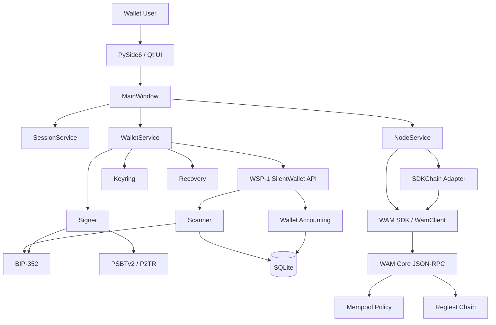
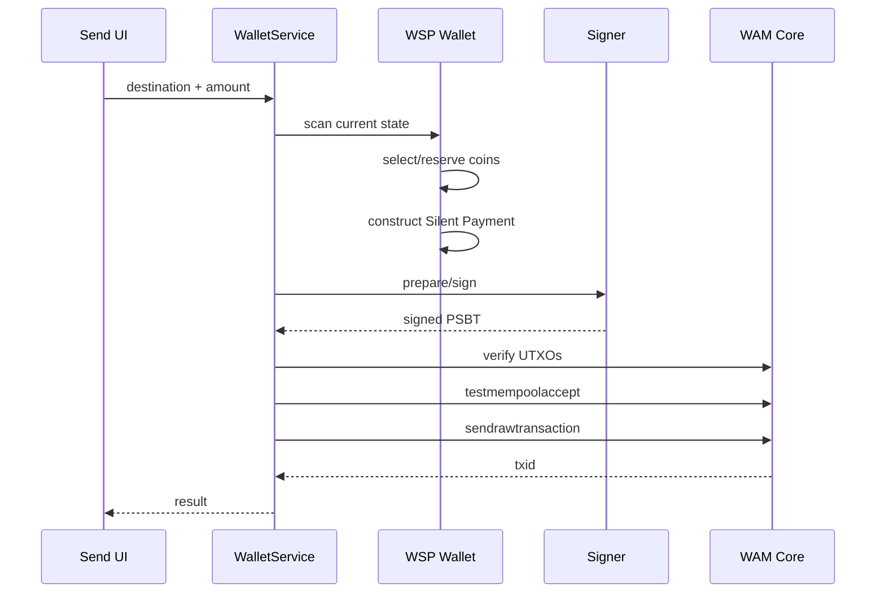

# Architecture



## Repository boundaries

### `wam-silent-wallet`
Owns UI, app lifecycle, session handling, wallet/node orchestration, packaging and regtest UX.

### `wam-silent-payments`
Owns BIP-352 derivation, secp256k1 operations, scanner, accounting, signing, PSBT, descriptors, recovery primitives, SQLite state and chain adapters.

### WAM SDK
Owns RPC configuration, cookie authentication and WAM Core client access.

### WAM Core
Owns consensus, UTXO/chain state, mempool policy, relay and confirmation.

## Send flow



## Node profile

```text
RPC: http://127.0.0.1:18443
Cookie: ~/wam/regtest-silent-wallet/regtest/.cookie
Network: REGTEST
```

## Recovery model

```text
encrypted recovery bundle
 -> keyring + descriptors + metadata
 -> fresh wallet database
 -> validating WAM node rescan
 -> recovered wallet state
```

Recovery verification uses a disposable database and does not overwrite the active wallet.

## Security boundary

Current assumptions:
1. host OS is not hostile;
2. local validating WAM node is trusted for consensus and prevout data;
3. encrypted wallet files are protected by the passphrase;
4. Python memory is not hardened native secret memory.
